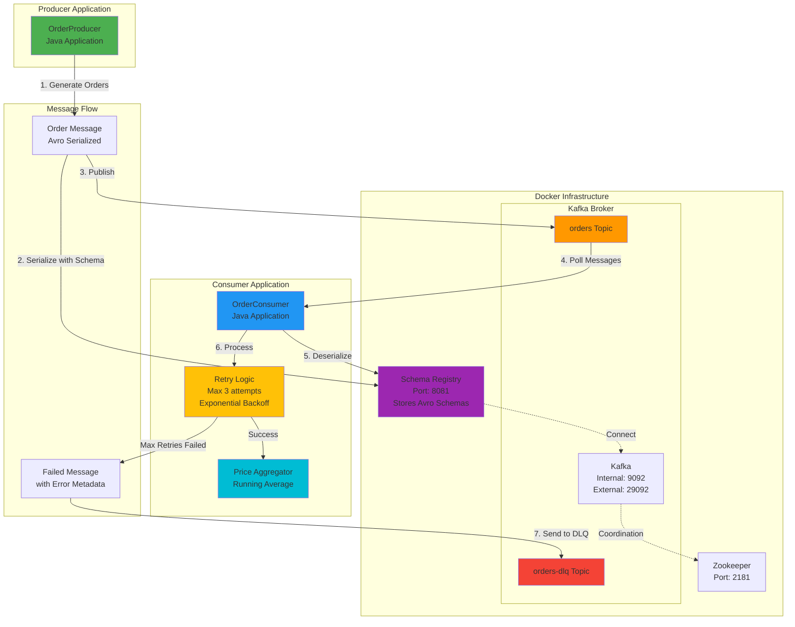
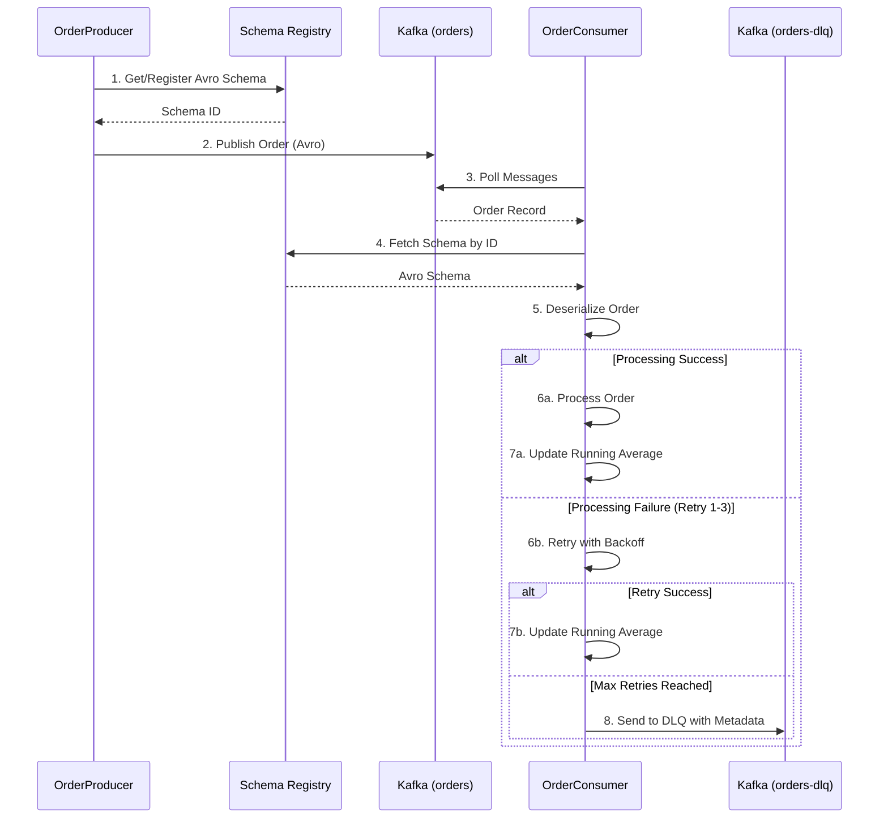
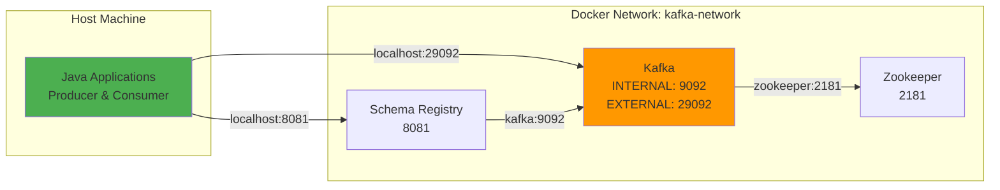
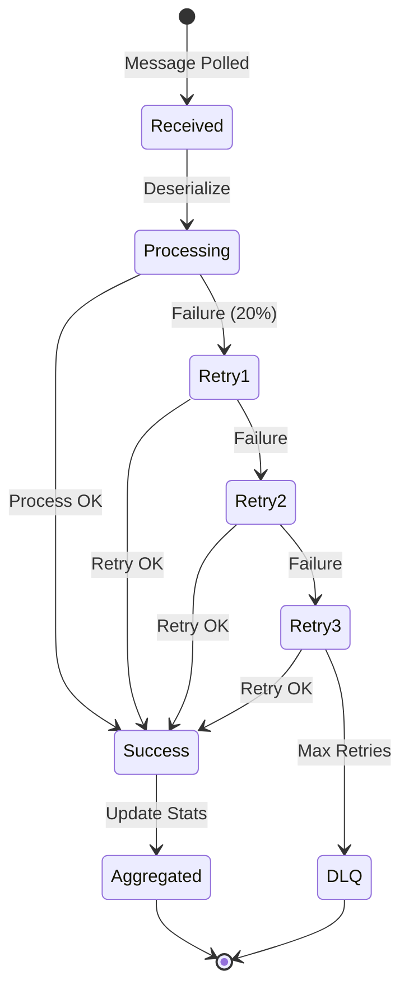

# Kafka Order Processing System - Architecture

## System Overview

This system implements a real-time order processing pipeline using Apache Kafka with Avro serialization, featuring retry logic, Dead Letter Queue (DLQ) handling, and price aggregation.

## Architecture Diagram



## Component Details

### 1. **OrderProducer** (Producer Application)
- **Purpose**: Generates random order messages
- **Configuration**:
  - Bootstrap Server: `localhost:29092`
  - Serialization: Avro (KafkaAvroSerializer)
  - Target Topic: `orders`
- **Behavior**:
  - Creates orders every 2 seconds
  - Random products from predefined list
  - Random prices ($10 - $1000)
  - Uses Schema Registry for Avro schema validation

### 2. **Kafka Broker**
- **Dual Listener Setup**:
  - **INTERNAL** (`kafka:9092`): For Docker container communication
  - **EXTERNAL** (`localhost:29092`): For host applications
- **Topics**:
  - `orders`: Main topic for order messages
  - `orders-dlq`: Dead Letter Queue for failed messages

### 3. **Schema Registry**
- **Purpose**: Centralized Avro schema management
- **Port**: 8081
- **Function**:
  - Stores and versions Avro schemas
  - Validates message compatibility
  - Enables schema evolution

### 4. **OrderConsumer** (Consumer Application)
- **Purpose**: Processes orders with fault tolerance
- **Configuration**:
  - Bootstrap Server: `localhost:29092`
  - Consumer Group: `order-consumer-group`
  - Deserialization: Avro (KafkaAvroDeserializer)

### 5. **Retry Logic**
- **Max Retries**: 3 attempts
- **Backoff Strategy**: Exponential (1s, 2s, 4s)
- **Failure Simulation**: 20% random failure rate (for demo)
- **On Max Retries**: Send to DLQ

### 6. **Price Aggregator**
- **Function**: Calculates running average of processed orders
- **Metrics Tracked**:
  - Total price sum
  - Message count
  - Running average price

### 7. **Dead Letter Queue (DLQ)**
- **Topic**: `orders-dlq`
- **Metadata Headers**:
  - `error.message`: Failure reason
  - `retry.count`: Number of retry attempts
  - `timestamp`: Failure timestamp

## Data Flow



## Avro Schema Structure

```json
{
  "type": "record",
  "name": "Order",
  "namespace": "com.assignment.kafka.avro",
  "fields": [
    {"name": "orderId", "type": "string"},
    {"name": "product", "type": "string"},
    {"name": "price", "type": "float"}
  ]
}
```

## Network Configuration



## Key Features

### ✅ **Fault Tolerance**
- Retry logic with exponential backoff
- Dead Letter Queue for permanent failures
- Error metadata preservation

### ✅ **Schema Management**
- Centralized schema registry
- Avro serialization for efficiency
- Schema evolution support

### ✅ **Real-time Processing**
- Continuous message consumption
- Running average calculation
- Low-latency processing

### ✅ **Observability**
- Detailed logging with SLF4J
- Success/failure tracking
- Performance metrics (partition, offset)

## Message Processing States



## Performance Characteristics

- **Message Rate**: 1 message every 2 seconds (configurable)
- **Processing Latency**: ~1-7 seconds (including retries)
- **Failure Rate**: 20% simulated (for demonstration)
- **Retry Delays**: 1s → 2s → 4s (exponential backoff)
- **Serialization**: Avro (compact binary format)

